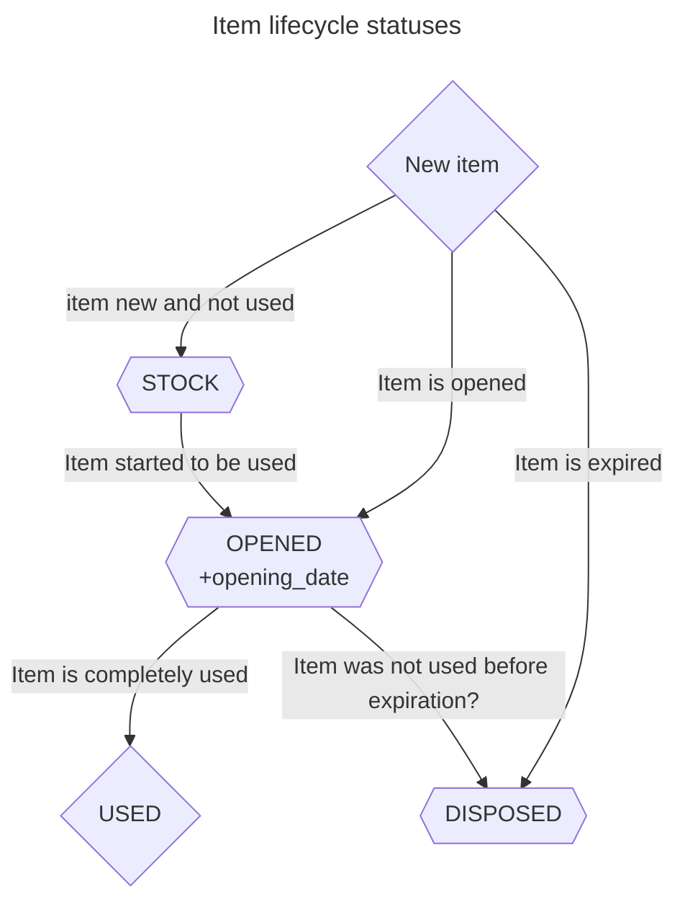

# Item lifecycle

Each item is representing single object (can/package/container) of goods or medication. And item flow can be represented with following statuses

```mermaid
---
title: Item lifecycle statuses
---
flowchart TB
    item{New item}--item new and not used-->stock{{STOCK}}
    item--Item is opened-->opened{{OPENED\n +opening_date}}
    item--Item is expired-->disposed{{DISPOSED}}
    stock--Item started to be used-->opened
    opened--Item is completely used-->used{USED}
    opened--Item was not used before expiration?-->disposed
```
